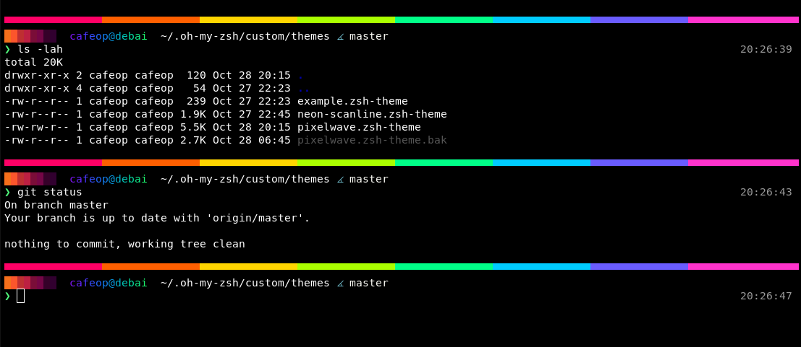

# PixelWave - a retro‑pixel, truecolor Zsh theme

**PixelWave** is a sleek, bright, vibrant Zsh theme that mixes old‑school pixel vibes with modern high‑color rendering. It shows a rainbow “pixel bar,” a neon‑colored identity line (via `lolcat`), your full path, and concise Git status.

> **Oh My Zsh** compatible out of the box, but it’s just Zsh—no external frameworks required.

---

## Preview



---

## Features

* **Two-line header**:

  * line 1: a crisp **rainbow “pixel bar”** (truecolor).
  * line 2: a **lolcat‑colored prefix** + **full path** (or `~/…` if under `$HOME`) + **Git branch & state**.
* **Clear prompt**: green `❯` when the last command succeeded, red `❯` on error.
* **Git status**: branch + symbols (✚ unstaged, ● staged, … untracked).
* **Truecolor** with hex codes (e.g., `%F{#ff79c6}`).
* **Minimal and fast**: no external plugins required beyond `git` and `lolcat`.

---

## Requirements

* **zsh** 5.x or newer
* **Git** (for the Git segment)
* **lolcat**

  * Used only to colorize the *prefix* on the second line.
  * This theme intentionally preserves a **hard‑coded path** (`/usr/games/lolcat`) because some rendering environments don’t have a usable `PATH`.
* **Font**: **JetBrains Mono**

  * If the branch glyph `` (`U+E0A0`) doesn’t render in your terminal/font, either use **JetBrains Mono** or set an alternate icon via `PW_BRANCH_ICON=⎇`.

> **Truecolor recommended**. In your shell profile, set:
>
> ```sh
> export COLORTERM=truecolor
> ```

---

## Installation (Oh My Zsh)

1. **Copy the theme file** into your custom themes directory:

   ```sh
   mkdir -p ~/.oh-my-zsh/custom/themes
   cp pixelwave.zsh-theme ~/.oh-my-zsh/custom/themes/pixelwave.zsh-theme
   ```

2. **Enable the theme** in `~/.zshrc`:

   ```sh
   ZSH_THEME="pixelwave"
   plugins=(git)   # recommended for git completions/aliases
   ```

3. **Restart your shell**:

   ```sh
   exec zsh -l
   ```

> PixelWave is pure Zsh; Oh My Zsh is optional. If you don’t use Oh My Zsh, source the theme in your `.zshrc` and set `PROMPT` accordingly.

---

## lolcat resolution & fallbacks (important)

To make this reliable across environments where `PATH` might be unavailable during prompt rendering, the theme resolves `lolcat` in this order:

1. `PW_LOLCAT` environment variable (absolute path), if set and executable.
2. `command -v lolcat`
3. **Fallback:** `/usr/games/lolcat` (intentionally hard‑coded and **never removed**).

If nothing above resolves, the theme still attempts to invoke `/usr/games/lolcat`, matching the original behavior. This contract is deliberate so rendering doesn’t silently change in constrained environments.

**Optional override:**

```sh
# Example: point directly to your lolcat binary
export PW_LOLCAT="$HOME/.local/bin/lolcat"
```

---

## Configuration

All knobs are optional; default behavior matches the checked‑in theme.

### Environment variables

* **`PW_LOLCAT`** — absolute path to `lolcat`. Takes priority if executable.
* **`PW_BRANCH_ICON`** — set an alternative branch icon if your font lacks ``.

  ```sh
  export PW_BRANCH_ICON=⎇
  ```
* **`COLORTERM`** — recommend `truecolor` for 24‑bit color:

  ```sh
  export COLORTERM=truecolor
  ```

### Theme palette

Edit the hex colors near the top of `pixelwave.zsh-theme`:

```zsh
typeset -ga PW_PALETTE=( 'ff0066' 'ff5f00' 'ffd500' 'aaff00' '00ff88' '00ccff' '6a5cff' 'ff33cc' )
```

### Change the prefix glyphs

The colored prefix on line 2 is just a string. Change it to anything you like (e.g., `▛▞▞▟`):

```zsh
prefix="██▓▓▒▒░░  $USER@${HOST%%.*}  "
# e.g.:
# prefix="▛▞▞▟  $USER@${HOST%%.*}  "
```

### Adjust the lolcat style

By default the theme uses:

```text
-f -p 1.0 -F 0.2 --seed 6131
```

* `--seed` (or `-S` on some builds) makes the gradient deterministic.
* You can change the seed or any flags in the `printf ... | lolcat ...` line inside `_pw_precmd`.

---

## Contributing

* Keep the **`/usr/games/lolcat` fallback call** intact to honor the rendering constraint described above.
* PRs that add optional features should keep defaults matching current behavior.
* Please include a short before/after screenshot in PRs affecting visuals.

---

## License

MIT - Use as you like.

